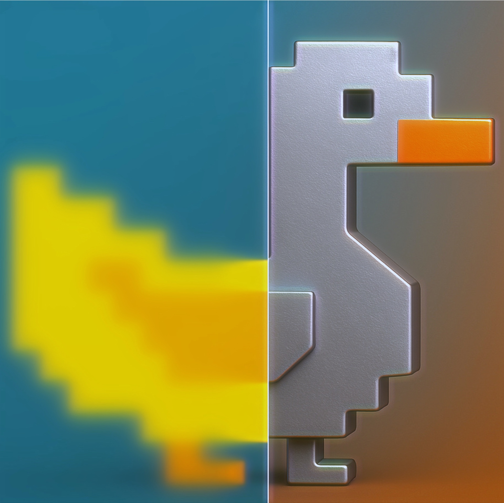

<div align="center">
  
  
  # MetalGoose
  
  **GPU-accelerated upscaling and frame generation for macOS**
  
  [](https://www.apple.com/macos/)
  [](https://developer.apple.com/metal/)
  [](LICENSE)
  [](https://swift.org)
  
  [Features](#features) • [Installation](#installation) • [Usage](#usage) • [Requirements](#requirements) • [Building](#building) • [License](#license)
</div>

---

## Overview

MetalGoose is a native macOS application that provides real-time upscaling and frame generation for games and applications. Built entirely with Apple's Metal framework, it delivers a smooth, high-FPS experience similar to NVIDIA DLSS or AMD FSR, but designed specifically for macOS.

## Features

### MGUP-1 Upscaling
- MetalFX Spatial upscaling with three quality profiles:
  - **Performance** — Fastest upscaling with minimal latency
  - **Balanced** — Optimal quality/performance ratio
  - **Ultra** — Maximum visual fidelity
- Multiple render scales: Native, 75%, 67%, 50%, 33%
- Contrast-adaptive sharpening (CAS)

### MGFG-1 Frame Generation
- MetalFX Frame Interpolation — generates one intermediate frame between two captured frames (2x output)
- Scene-cut detection to avoid interpolating across hard cuts (falls back to passthrough)
- Output frame rate is snapped to a divisor of the display refresh rate

### Anti-Aliasing
Post-process anti-aliasing that runs on the final captured image, with no need
for depth buffers or motion vectors:
- **FXAA** — Fast approximate anti-aliasing (relative edge threshold + subpixel pass)
- **SMAA** — Subpixel morphological AA with local contrast adaptation

### Performance Monitoring
- Real-time HUD overlay
- Capture/Output/Interpolated FPS tracking
- GPU time and frame time metrics
- VRAM usage monitoring
- Frame statistics

## Requirements

| Component | Requirement |
|-----------|-------------|
| **macOS** | 26.0 (Tahoe) or later |
| **Chip** | Apple Silicon (M1/M2/M3/M4)
| **Xcode** | 26.0 or later |
| **RAM** | 8 GB minimum, 16 GB recommended |

## Installation

### Download Release
1. Download the latest release from [Releases](https://github.com/Stallion77RepoOfficial/MetalGoose/releases)
2. Move `MetalGoose.app` to `/Applications`
3. Grant Screen Recording and Accessibility permissions when prompted

### Build from Source
```bash
git clone https://github.com/Stallion77RepoOfficial/MetalGoose
cd MetalGoose
open MetalGoose.xcodeproj
```

## Usage

1. **Launch MetalGoose**
2. **Select Target**
   - Choose a window or display to capture
3. **Configure Settings**
   - Enable upscaling (MGUP-1)
   - Enable frame generation (MGFG-1) 
   - Select anti-aliasing mode
4. **Start Scaling**
   - Click "Start" to begin processing

### Keyboard Shortcuts

| Shortcut | Action |
|----------|--------|
| `⌘ + ⇧ + T` | Toggle Scale |
| `⌘ + ⇧ + C` | Toggle Cursor Sprite Visibility |

# MetalGoose Error Codes

## UI (MG-UI)
- MG-UI-002: Frontmost app is MetalGoose; user must switch to target window.
- MG-UI-003: Target window not found for the selected app.
- MG-UI-004: No display found.
- MG-UI-006: Target window bounds unavailable.
- MG-UI-007: Display ID not found for target screen.

## Capture (MG-CAP)
- MG-CAP-001: Target window not found by ScreenCaptureKit.
- MG-CAP-002: ScreenCaptureKit start error.
- MG-CAP-003: ScreenCaptureKit stop error.
- MG-CAP-004: Stream stopped with error.

## Engine (MG-ENG)
- MG-ENG-001: Metal pipeline setup failed.
- MG-ENG-002: Metal device not available.
- MG-ENG-003: Metal command queue not available.
- MG-ENG-004: MetalFX Spatial Scaler creation failed.
- MG-ENG-007: Anti-aliasing pipeline unavailable.
- MG-ENG-008: Scale pipeline unavailable.
- MG-ENG-009: CAS pipeline unavailable.
- MG-ENG-010: IOSurface texture creation failed.
- MG-ENG-011: Copy pipeline unavailable.
- MG-ENG-013: MetalFX Frame Interpolator creation failed.
- MG-ENG-014: Cursor pipeline setup failed.

## Overlay (MG-OV)
- MG-OV-001: Target screen missing for overlay creation.
- MG-OV-002: Window frame missing for overlay creation.

## License

This project is licensed under the GNU General Public License v3.0 - see the [LICENSE](LICENSE) file for details.

## Acknowledgments

- Apple for the Metal framework and documentation
- The macOS gaming community for feedback and testing
- Contributors who helped improve the project

---

RESOURCES THAT USED FOR THIS PROJECT

https://developer.apple.com/documentation/metal
https://developer.apple.com/documentation/metalfx/
https://developer.apple.com/documentation/screencapturekit/
https://developer.apple.com/documentation/appkit
https://developer.apple.com/documentation/metal/mtltexture
https://developer.apple.com/documentation/corevideo/cvpixelbuffer
https://developer.apple.com/documentation/metal/compute-passes
https://developer.apple.com/documentation/ScreenCaptureKit/capturing-screen-content-in-macos


<div align="center">
  <sub>Built with ❤️ using Metal for macOS</sub>
</div>
