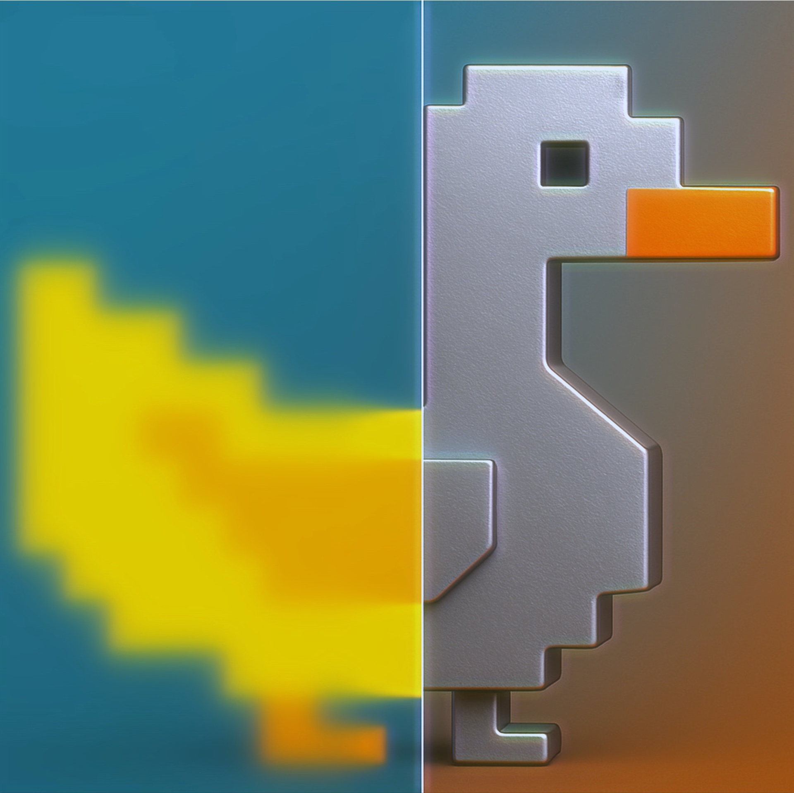

<div align="center">
  
  
  # MetalGoose
  
  **GPU-accelerated upscaling and frame generation for macOS**
  
  [](https://www.apple.com/macos/)
  [](https://developer.apple.com/metal/)
  [](LICENSE)
  [](https://swift.org)
  
  [Features](#features) • [Installation](#installation) • [Usage](#usage) • [Requirements](#requirements) • [Building](#building) • [License](#license)
</div>

---

## Overview

MetalGoose captures a window with ScreenCaptureKit, runs MetalFX spatial
upscaling and frame generation over the captured frames, and presents the result
in a borderless overlay pinned to the source window. It works on any window, not
only games — anything that renders faster than it is being watched.

## Features

### MGUP-1 Upscaling
- MetalFX Spatial upscaling with three quality profiles:
  - **Performance** — Fastest upscaling with minimal latency
  - **Balanced** — Optimal quality/performance ratio
  - **Ultra** — Maximum visual fidelity
- Multiple render scales: Native, 75%, 67%, 50%, 33%
- Contrast-adaptive sharpening (CAS)

### MGFG-1 Frame Generation
- MetalFX Frame Interpolation — generates one intermediate frame between two captured frames (2x output)
- Scene-cut detection to avoid interpolating across hard cuts (falls back to passthrough)
- Output frame rate is snapped to a divisor of the display refresh rate

### Anti-Aliasing
Post-process anti-aliasing that runs on the final captured image, with no need
for depth buffers or motion vectors:
- **FXAA** — Fast approximate anti-aliasing (relative edge threshold + subpixel pass)
- **SMAA** — Subpixel morphological AA with local contrast adaptation

### Performance Monitoring
A HUD overlay reports, live:
- **Capture / Output / Generated / Unique** frame rates
- Capture time, GPU time, and the latency the pipeline adds before present
- VRAM, process memory, and CPU
- Cumulative counters, where `Gen Presents + Passthrough = Presented`

## Requirements

| Component | Requirement |
|-----------|-------------|
| **macOS** | 26.5 (Tahoe) or later |
| **Chip** | Apple Silicon (M1/M2/M3/M4) |
| **Xcode** | 26.6 or later (macOS 26.5 SDK) |
| **Swift** | 6.3 toolchain, Swift 6 language mode |
| **RAM** | 8 GB minimum, 16 GB recommended |

## Installation

### Download Release
1. Download the latest release from [Releases](https://github.com/Stallion77RepoOfficial/MetalGoose/releases)
2. Move `MetalGoose.app` to `/Applications`
3. Open `Terminal` and type `xattr -dr com.apple.quarantine /Applications/MetalGoose.app`
4. Grant Screen Recording and Accessibility permissions when prompted

### Build from Source
```bash
git clone https://github.com/Stallion77RepoOfficial/MetalGoose
cd MetalGoose
open MetalGoose.xcodeproj
```

## Usage

1. Launch MetalGoose and grant Screen Recording and Accessibility access.
2. Configure upscaling (MGUP-1), frame generation (MGFG-1), and anti-aliasing.
3. Switch to the window you want to capture — it has to be frontmost, since
   MetalGoose targets whichever app is in front when scaling starts.
4. Press `⌘⇧T`, or return to MetalGoose and click **Start Scaling**.

### Keyboard Shortcuts

| Shortcut | Action |
|----------|--------|
| `⌘ + ⇧ + T` | Start or stop scaling |
| `⌘ + ⇧ + C` | Show or hide the cursor sprite |

Both are global and outlive the main window, so closing it with `⌘W` leaves the
overlay running and `⌘⇧T` still stops it.

## Error Codes

All error codes are shown as an in-app alert.

### UI (MG-UI)
- MG-UI-001: Frontmost app is MetalGoose; user must switch to target window.
- MG-UI-002: Target window not found for the selected app.
- MG-UI-003: Target window bounds unavailable.
- MG-UI-004: No display found.
- MG-UI-005: Display ID not found for target screen.

### Capture (MG-CAP)
- MG-CAP-001: Target window not found by ScreenCaptureKit.
- MG-CAP-002: ScreenCaptureKit start error.
- MG-CAP-003: ScreenCaptureKit stop error.
- MG-CAP-004: Stream stopped with error.
- MG-CAP-005: Target entered macOS fullscreen — use windowed or borderless (windowed fullscreen) mode.
- MG-CAP-007: Capture reconfiguration failed when applying a new render scale.

### Engine (MG-ENG)
- MG-ENG-001: Metal pipeline setup failed.
- MG-ENG-002: Metal device not available.
- MG-ENG-003: Metal command queue not available.
- MG-ENG-004: MetalFX Spatial Scaler creation failed.
- MG-ENG-005: Anti-aliasing pipeline unavailable.
- MG-ENG-007: CAS pipeline unavailable.
- MG-ENG-008: IOSurface texture creation failed.
- MG-ENG-009: Copy pipeline unavailable.
- MG-ENG-010: MetalFX Frame Interpolator creation failed.
- MG-ENG-011: Cursor pipeline setup failed.

### Overlay (MG-OV)
- MG-OV-001: Target screen missing for overlay creation.
- MG-OV-002: Window frame missing for overlay creation.

## License

This project is licensed under the GNU General Public License v3.0 - see the [LICENSE](LICENSE) file for details.

<div align="center">
  <sub>Built with ❤️ using Metal for macOS</sub>
</div>
## References

Apple documentation this project was built against:

- [Metal](https://developer.apple.com/documentation/metal) and
  [compute passes](https://developer.apple.com/documentation/metal/compute-passes)
- [MetalFX](https://developer.apple.com/documentation/metalfx/) — spatial scaling
  and frame interpolation
- [ScreenCaptureKit](https://developer.apple.com/documentation/screencapturekit/)
  and [capturing screen content in macOS](https://developer.apple.com/documentation/ScreenCaptureKit/capturing-screen-content-in-macos)
- [MTLTexture](https://developer.apple.com/documentation/metal/mtltexture) and
  [CVPixelBuffer](https://developer.apple.com/documentation/corevideo/cvpixelbuffer)
  — the IOSurface-backed path between capture and render
- [CADisplayLink](https://developer.apple.com/documentation/quartzcore/cadisplaylink)
  — the frame clock the pacing loop runs on
- [AppKit](https://developer.apple.com/documentation/appkit) — the overlay window
