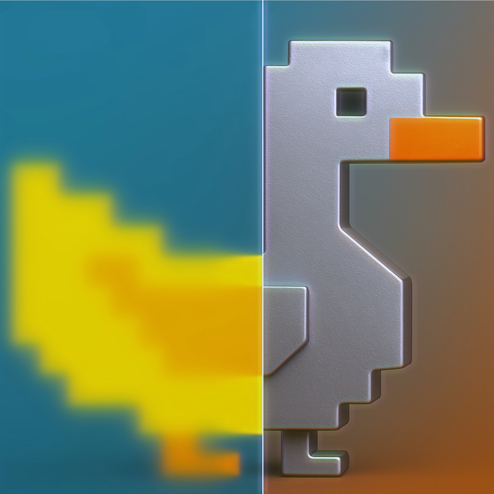

<div align="center">
  
  
  # MetalGoose
  
  **GPU-accelerated upscaling and frame generation for macOS**
  
  [](https://www.apple.com/macos/)
  [](https://developer.apple.com/metal/)
  [](LICENSE)
  [](https://swift.org)
  
  [Features](#features) • [Installation](#installation) • [Usage](#usage) • [Requirements](#requirements) • [Building](#build-from-source) • [License](#license)
</div>

---

## Overview

MetalGoose captures a window with ScreenCaptureKit, runs MetalFX spatial
upscaling and frame generation over the captured frames, and presents the result
in a borderless overlay pinned to the source window. It works on any window, not
only games — anything that renders faster than it is being watched. Menus, popups,
tooltips and dialogs the app opens over its window are captured with it while they
are open, so they stay visible on the overlay.

## Features

### MGUP-1 Upscaling
- MetalFX Spatial upscaling to the overlay's size. **Scale Factor** (1.0x–10.0x, or Fullscreen)
  sets the overlay size; **Render Scale** (Native, 75%, 67%, 50%, 33%) lowers the resolution
  ScreenCaptureKit delivers.
- **Sharpening** — Light, Balanced or Strong: contrast-adaptive sharpening (CAS) strength and
  anti-aliasing sensitivity.

### MGFG-1 Frame Generation
MGFG-1 makes the images between two captures by interpolation. The Neural Engine does it where it can, and MetalFX on
the GPU where it cannot, and a single choice is made for every capture so that the two work as one. The HUD's
**Frame Gen** row says MGFG-1 and the multiplier in use; its **Engine** row names the engine making the images (and the
size the Neural Engine works at, where that is not the capture's own), or says why none is: Starting while the Neural
Engine's session is being built, Not keeping up, or Display-limited.

- **Neural Engine** — VideoToolbox low-latency frame interpolation, for 2x and 4x. It leaves the GPU to the captured
  app: the GPU converts the capture to 4:2:0 once, and turns an image into colour only as it is shown. It works at the
  largest size it takes (1920 px on a side, 2.07 MP): a larger capture is shrunk for it and its images are enlarged as
  they are blended with the captures, so a 1440p or 4K window is covered too. Where the capture rate leaves no time for
  that size, it works at a coarser one — 1280×720 or 960×540 — rather than giving way; so it does where the captures come
  unevenly, as a 60 fps source does on a 120 Hz panel (a tenth of them arrive 8 ms after the one before), since a pair
  that arrives while the last is still being made would go by without its images. A size it has not been used at takes
  a second or two to prepare, the first time; the session that is serving goes on until the new one has started, and
  MetalFX stands in meanwhile.
- **MetalFX** — interpolation with the media engine's motion field, for 2x where the Neural Engine cannot be used or
  cannot keep up. It is the more faithful of the two, makes the midpoint only, and uses GPU time.
- Where neither can make its images before the next capture is due, nothing is held back: the captures are shown as
  they arrive.
- **Multiplier** — images presented per captured frame: 2x (the midpoint of each pair) or 4x (its quarters, on the
  Neural Engine). 4x is made while the panel shows at least two and a half refreshes per capture — at 120 Hz up to about
  46 captures a second; where it shows fewer than four, each refresh shows the quarter nearest its moment, which keeps the
  motion more even than the midpoint alone. Below that it is 2x (4x at 30 captures a second on a 60 Hz panel is 2x), and
  4x falls back to 2x where the quarters do not fit the time between captures. The HUD's Target is never more than the
  panel's refresh rate.
- **Interface and text stay as captured** — where the content did not move between the two captures (an interface,
  text, a still background) they are blended back into the generated image, which keeps what did not move: the Neural
  Engine's images are lossy there, and MetalFX's gain a little. What counts is how much the captures differ compared with
  how much there is to differ, which is about how far the content moved, so a low contrast texture that is moving keeps
  the engine's image and is not cross-faded.
- **When there is no room, nothing is made** — where the panel shows fewer than about two images in a capture interval
  (60 captures a second on a 60 Hz panel, 120 on 120), a generated image would never be seen, and the captures are shown
  as they arrive with nothing held back. The HUD says Display-limited.

Interpolation holds the newest capture back by most of a capture interval plus the time the first generated image
takes to make (some 40 to 50 ms at 30 captures a second). That delay is eased where it falls, so that a change of
engine or load does not step the motion on the screen. The schedule runs on ScreenCaptureKit's presentation times —
the compositor's, on the display's refresh grid — rather than on when each capture happened to reach the pipeline. For a
game that presents in step with the display (30, 60 or 120 a second), the delay is also chosen so that the display's
refreshes fall clear of the points where one image gives way to the next: every image is then shown on its refresh,
where a delay set by the measured latency alone could put them on those points, and lose some of the images and pace the
rest unevenly, at latencies that came in bands a refresh apart.

An engine is left at once when it stops keeping up, and not tried again for 30 seconds; a better one is taken only when
it would keep up with room to spare and the choice has stood for 10 seconds, so a rate near a limit does not move the
engine back and forth. With Render Scale below 100%, generation works on the reduced capture and the final scale-up
treats captured and generated frames alike; only the Neural Engine takes the window's own size, when that fits it,
which measured closer to the real image. Scene-cut detection avoids generating across hard cuts.

Resize and reappearance may redraw an existing image. The HUD counts new images when the drawable
reports an actual presentation, so **Generated + Passthrough = Presented** remains true.

### Anti-Aliasing
Post-process anti-aliasing that runs on the final captured image, with no need
for depth buffers or motion vectors:
- **FXAA** — Fast approximate anti-aliasing (relative edge threshold + subpixel pass)
- **SMAA** — Morphological AA: pattern-based edge blending with local contrast adaptation and sharp-corner preservation

### Performance Monitoring
A HUD overlay reports, live:
- **Capture / Output / Generated** frame rates, the **Target** output (capture rate × the multiplier
  in use, which Output is coloured against), and the panel's refresh rate
- Capture interval, total completed GPU command-buffer time per new presented image,
  **GPU Budget** (command-buffer duration divided by elapsed wall time), capture latency,
  presentation latency, end-to-end latency, and a frame-pacing score. GPU Budget includes
  capture, motion, interpolation, and render work; overlap and preemption can inflate it.
  It is a workload estimate, not a hardware utilization percentage. End-to-end latency uses
  the presented image's source compositor timestamp; it is not input-to-photon latency.
- VRAM, process memory, and CPU
- Cumulative counters: Captured, Presented, Generated, Passthrough, Dropped

## Requirements

| Component | Requirement |
|-----------|-------------|
| **macOS** | 27.0 or later |
| **Chip** | Apple Silicon (M1/M2/M3/M4) |
| **Xcode** | 27 or later (macOS 27 SDK) |
| **Metal** | Metal 4.1, shaders built as Metal Shading Language 4.1 |
| **Swift** | 6.4 toolchain, Swift 6 language mode |
| **RAM** | 8 GB minimum, 16 GB recommended |

## Installation

### Download Release
1. Download the latest release from [Releases](https://github.com/Stallion77RepoOfficial/MetalGoose/releases)
2. Move `MetalGoose.app` to `/Applications`
3. Open `Terminal` and type `xattr -dr com.apple.quarantine /Applications/MetalGoose.app`
4. Grant Screen Recording and Accessibility before starting scaling

### Build from Source
```bash
git clone https://github.com/Stallion77RepoOfficial/MetalGoose
cd MetalGoose
open MetalGoose.xcodeproj
```

The project uses **Apple Development** signing to keep its identity stable across rebuilds.
Select your own development team and certificate in Xcode, then build and run the MetalGoose
scheme on My Mac. Screen Recording and Accessibility both require user permission before
scaling. You can also select your team locally without changing the shared project:

```bash
xcodebuild -project MetalGoose.xcodeproj -scheme MetalGoose -configuration Release \
  DEVELOPMENT_TEAM=YOUR_TEAM_ID CODE_SIGN_IDENTITY="Apple Development" build
```

To build without a development certificate, choose **Sign to Run Locally**, or use:

```bash
xcodebuild -project MetalGoose.xcodeproj -scheme MetalGoose -configuration Release \
  DEVELOPMENT_TEAM= CODE_SIGN_IDENTITY="-" build
```

Metal, MetalFX, and VideoToolbox use the same hardware and OS support with either signing
method. Ad hoc rebuilds or a change of signing identity can require granting privacy
permissions again.

Distributing a notarized app outside the Mac App Store requires **Developer ID Application**
signing, which is separate from Apple Development and local signing. Keep private keys,
`.p12` exports, and account credentials out of the repository. A Team ID is an identifier,
not a signing credential. See Apple's [code-signing certificates](https://developer.apple.com/documentation/technotes/tn3161-inside-code-signing-certificates),
[code identity and privacy permissions](https://developer.apple.com/documentation/technotes/tn3127-inside-code-signing-requirements),
and [Developer ID distribution](https://developer.apple.com/developer-id/) documentation.

CI builds and analyzes the app on macOS 27 with Xcode 27 and the macOS 27 SDK.

### Languages

English is the source and fallback language. The app follows macOS language preferences and
supports English, Turkish, German, Spanish, Russian, Simplified Chinese, Japanese, and Hungarian.
Translations include the settings, HUD, update messages, errors, and privacy descriptions.
User-facing text belongs in `Localizable.xcstrings` or `InfoPlist.xcstrings`; persisted setting
identifiers and error codes remain stable when the display language changes.

## Usage

1. Launch MetalGoose and grant Screen Recording and Accessibility access.
2. Configure upscaling (MGUP-1), frame generation (MGFG-1), and anti-aliasing. Changes apply
   to a running session.
3. Switch to the window you want to capture — it has to be frontmost, since
   MetalGoose targets whichever app is in front when scaling starts.
4. Press `⌘⇧T`, or return to MetalGoose and click **Start Scaling**.

### Pointer

Where the overlay is bigger than the window (a Scale Factor above 1.0x, or Fullscreen) the window is not where its picture
is, so **Align Pointer** takes the pointer to the picture: the system pointer is kept inside the window and hidden, and
the overlay draws one where the pointer appears in the scaled picture, so a click lands under it. This needs Accessibility,
which is how mouse events are held inside the window. While an app has taken the mouse for itself, to look around with, no
pointer is drawn. Turn Align Pointer off to leave the system pointer alone; at 1.0x there is nothing to align.

### Keyboard Shortcuts

| Shortcut | Action |
|----------|--------|
| `⌘ + ⇧ + T` | Start or stop scaling |
| `⌘ + ⇧ + C` | Show or hide the cursor sprite |

Both are global and outlive the main window, so closing it with `⌘W` leaves the
overlay running and `⌘⇧T` still stops it.

## Error Codes

All error codes are shown as an in-app alert.

### UI (MG-UI)
- MG-UI-001: Frontmost app is MetalGoose; user must switch to target window.
- MG-UI-002: Target window not found for the selected app.
- MG-UI-004: No display found.
- MG-UI-005: Display ID not found for target screen.
- MG-UI-006: Display refresh rate unavailable for target screen.
- MG-UI-007: A global shortcut (`⌘⇧T` or `⌘⇧C`) is already registered by another app.

### Capture (MG-CAP)
- MG-CAP-001: Target window not found by ScreenCaptureKit.
- MG-CAP-002: ScreenCaptureKit start error.
- MG-CAP-003: ScreenCaptureKit stop error.
- MG-CAP-004: Stream stopped with error.
- MG-CAP-005: Target entered macOS fullscreen — use windowed or borderless (windowed fullscreen) mode.
- MG-CAP-007: Capture reconfiguration failed when applying a new render scale.

### Engine (MG-ENG)
- MG-ENG-001: Metal pipeline setup failed.
- MG-ENG-002: Metal device not available.
- MG-ENG-003: Metal command queue not available.
- MG-ENG-004: MetalFX Spatial Scaler creation failed.
- MG-ENG-005: Anti-aliasing pipeline unavailable.
- MG-ENG-007: CAS pipeline unavailable.
- MG-ENG-008: IOSurface texture creation failed.
- MG-ENG-010: MetalFX Frame Interpolator creation failed.
- MG-ENG-011: GPU command execution failed; the alert includes the stage and provider detail.

Codes are identifiers and are not renumbered when one is retired, so the lists have gaps.

## License

This project is licensed under the GNU General Public License v3.0 - see the [LICENSE](LICENSE) file for details.

## References

Apple documentation this project was built against:

- [Metal](https://developer.apple.com/documentation/metal) and
  [compute passes](https://developer.apple.com/documentation/metal/compute-passes)
- [MetalFX](https://developer.apple.com/documentation/metalfx/) — spatial scaling
  and frame interpolation
- [ScreenCaptureKit](https://developer.apple.com/documentation/screencapturekit/)
  and [capturing screen content in macOS](https://developer.apple.com/documentation/ScreenCaptureKit/capturing-screen-content-in-macos)
- [MTLTexture](https://developer.apple.com/documentation/metal/mtltexture) and
  [CVPixelBuffer](https://developer.apple.com/documentation/corevideo/cvpixelbuffer)
  — the IOSurface-backed path between capture and render
- [CAMetalDisplayLink](https://developer.apple.com/documentation/quartzcore/cametaldisplaylink)
  — the frame clock the render thread runs on
- [VideoToolbox](https://developer.apple.com/documentation/videotoolbox) — motion estimation on
  the media engine and low-latency frame interpolation on the Neural Engine
- [AppKit](https://developer.apple.com/documentation/appkit) — the overlay window

<div align="center">
  <sub>Built with ❤️ using Metal for macOS</sub>
</div>
